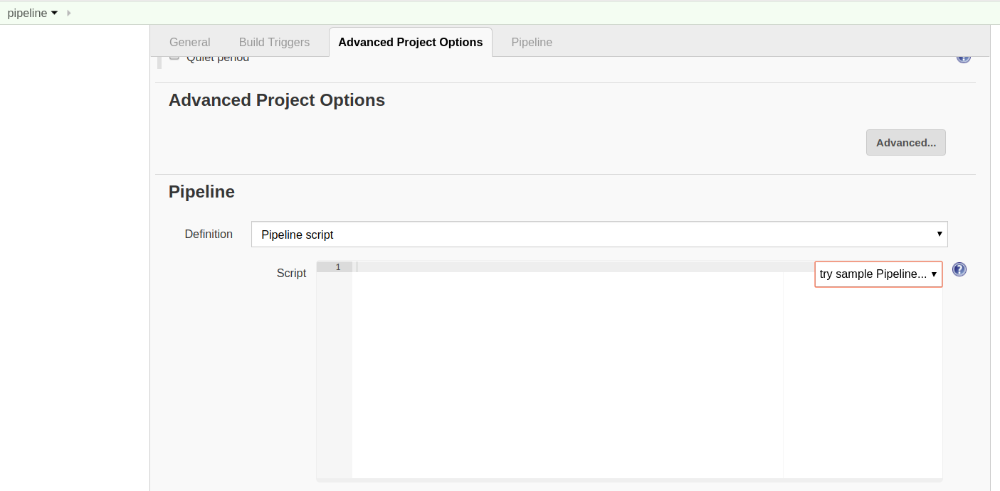
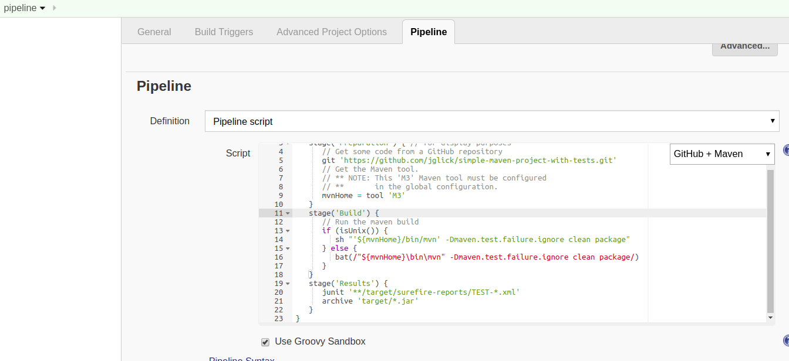

# Jenkins

Make sure mchine running Jenkins has 
1. java is correctly installed
1. mvn is correctly installed

## Install and configure Jenkins

1. Download latest jenkins from machine

1. Open command line and launch jenkins


      java -jar jenkins.war
      
## Setup M3 in Jenkins


### Build a pipeline job using Jenkins

Enter some name of Pipeline and click Second item from list
Once complete click "OK"


Now under section of Pipeline. Click on Try sample and create Job



Finishing insert should look like below




### Create a maven project for TestNG

Modify maven project remove Junit dependency and add below

   		 <dependency>
			<groupId>org.testng</groupId>
			<artifactId>testng</artifactId>
			<version>6.8.5</version>
		</dependency>
    
### Add TestNG test suite in the project
### Integrate it with Jenkins

# Extra (not part of Session Labs)
## Selenium TestNG working example

```groovy
node {
   def mvnHome
   stage('Preparation') { // for display purposes
      // Get some code from a GitHub repository
      git 'https://github.com/apptitude-in/Java-Selenium-TestNG-Automation-Framework.git'
      // Get the Maven tool.
      // ** NOTE: This 'M3' Maven tool must be configured
      // **       in the global configuration.           
      mvnHome = tool 'M3'
   }
   stage('Build') {
      // Run the maven build
      if (isUnix()) {
         sh "'${mvnHome}/bin/mvn' -Dmaven.test.failure.ignore clean package -Pdev"
      } else {
         bat(/"${mvnHome}\bin\mvn" -Dmaven.test.failure.ignore clean package -Pdev/)
      }
   }
   stage('Results') {
      junit '**/target/surefire-reports/TEST-*.xml'
      archive 'target/*.jar'
   }
}

